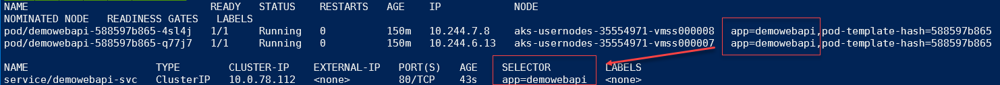

# Demo 1: CluserIP Service

## Introduction
In this demo you will create a ClusterIP service for an pod containing an API called **demowebapi**

### Setup 
create the deployment containing 2 pods.  

``` bash
kubectl apply -f .\deployment-simpleapi.yaml
```

Show pods up and running including the assigned labels 
``` bash
kubectl get pods --show-labels
```

Sample output
``` cmd
demowebapi-588-4sl4j   1/1     Running   0          4m7s   app=demowebapi,pod-template-hash=588
demowebapi-588-q77j7   1/1     Running   0          4m7s   app=demowebapi,pod-template-hash=588
```
>NOTE:  Your template-hash label will be different

### Task 1 - Create a Service of type ClusterIP
Now that we have 2 pods hosting the API we need a way to route traffic to those pods.  We'll create a ClusterIP Service to give us a single, discoveralbe endpointto route traffic to our pods.

```bash
cat clusterip-service.yaml
```


```bash
kubectl deploy -f clusterip-service.yaml
```
### Task 2 - Verify routes
Show that the pods labels match the service selector 
```bash
kubectl get pod,svc --show-labels  -o wide
```


You can view the Endpoints with same name as the service to verify it found the correct pods 

```bash
kubectl get pod,svc,ep -o wide
```


### Task 3 - Scale deployment and verify endpoints 

```bash
kubectl scale --replicas=3  deploy/demowebapi
```
Verify the new pod ip address was added to the service endpoints 
```bash
kubectl get pod,svc,ep -o wide
```
Sample Output
```
NAME                       ENDPOINTS                                 
endpoints/demowebapi-svc   10.244.5.6:80,10.244.6.13:80,10.244.7.8:80
```
For a complete picture of the service including endpoints, ports and event use the ```describe``` command 

```bash
kubectl describe svc/demowebapi-svc
```
Sample Output
```bash
Name:              demowebapi-svc
Namespace:         default
Labels:            <none>
Annotations:       <none>
Selector:          app=demowebapi
Type:              ClusterIP
IP Family Policy:  SingleStack
IP Families:       IPv4
IP:                10.0.214.110
IPs:               10.0.214.110
Port:              <unset>  80/TCP
TargetPort:        80/TCP
Endpoints:         10.244.0.8:80,10.244.1.4:80,10.244.1.5:80
Session Affinity:  None
Events:            <none>
```

### Task 4 - Use a JumpBox pod to test clusterIP Server
The ClusterIP service needs to be accessed from within the cluster, since by dev box is not part of the cluster one way to accomplish this is to create a jumbox and test the endpoint from the JumpBox

Create and attach to a jumpbox.  The BusyBox image is a standard image with many utilities pre-installed including ```wget```

```bash
kubectl run -it --rm  jumpbox  --image=busybox
```
From the JumpBox pod issue the following command to contact the service.  Notice we are using the name of the service ```demowebapi-svc``` which AKS will resolve to the IP Address, then the service will forward the request to one of the pods referenced in the EndPoints

```bash
wget -q -O - http://demowebapi-svc/api/hostname; echo
```
The output should be the name of one of the 3 pods.  Issue the command several times to show that name changes indicating that the service is routing the request to different pods 

```
/# wget -q -O - http://demowebapi-svc/api/hostname; echo
demowebapi-588597b865-4sl4j
/# wget -q -O - http://demowebapi-svc/api/hostname; echo
demowebapi-588597b865-vcmm6
/# wget -q -O - http://demowebapi-svc/api/hostname; echo
demowebapi-588597b865-4sl4j
/# wget -q -O - http://demowebapi-svc/api/hostname; echo
demowebapi-588597b865-vcmm6
/# wget -q -O - http://demowebapi-svc/api/hostname; echo
demowebapi-588597b865-q77j7
/#
```

### Cleanup 
1. Exit from the jumpbox by typing:  ```exit```

    output 
    ```
    /# exit
    Session ended, resume using 'kubectl attach jumpbox -c jumpbox -i -t' command when the pod is running
    pod "jumpbox" deleted
    ```
1. delete the ClusterIP Service (keep the deployment for the next demo)

    ```kubectl delete svc/demowebapi-svc```
