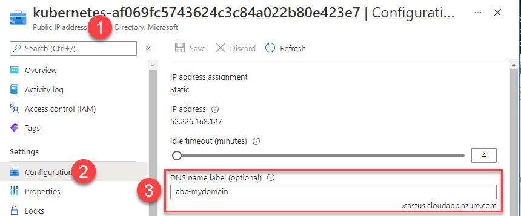

# DEMO 2: Load Balancer Service

## Introduction
In this demo you will deploy a web app that will use the API deployed in the previous demo. Then create a LoadBalancer service to for a public facing web site. Demonstrate the following topics

1. Azure Load Balancer resource used by AKS for public facing ingress
1. Internal Azure Load Balancer for private deployments 
1. Load Balancer Annotations


### Task 1: Review Portal
First lets review the default Azure Load Balancer created when you create an AKS Cluster. 

1. Review portal and show load balancer,  review some of the load balancer options
  1. From the [Azure Portal](https://portal.azure.com) Navigate to resource group **mc_akstechbriefing_aks-briefing_eastus**
  1. Review Config Options 
        1. Settings -> FrontEnd IP: currently single ip for ingress & egress
        1. Settings -> Backend Pools:  outbound manages egress from cluster nodes. Pool consists of all nodes in cluster.

>NOTE: The Azure LoadBalancer routes traffic to the Nodes (NodePort) in your cluster **not** the individual pods. The NodePort routes the traffic to the ClusterIP and the ClusterIP routes the traffic to a pod.


### Task 2: Setup 
Create a deployment for the website consisting of 2 pods

```bash
kubectl apply -f .\deployment-webapp.yaml
```
Once the pods are ready
```bash
NAME                          READY   STATUS    RESTARTS   AGE
demowebapi-858974b66b-6sgzm   1/1     Running   0          1h
demowebapi-858974b66b-b7gp6   1/1     Running   0          1h
webapp-5d7d6f45fb-2fjvt       1/1     Running   0          9m
webapp-5d7d6f45fb-htbcq       1/1     Running   0          9m
```

### Task 3: Create Load Balancer Service
Review the [YAML](loadbalancer-service.yaml) for the Public Load Balancer. Note the major difference between a **ClusterIP** and **LoadBalancer** service the the **type** defined in the YAML

```yaml
kind: Service
apiVersion: v1
metadata:
  name: webapp-svc
spec:
  selector:
    app: demowebapp
  ports:
    - protocol: TCP
      port: 80
      targetPort: 80
  type: LoadBalancer
```
Deploy the LoadBalancer service for the Web Application 
```bash
kubectl apply -f loadbalancer-service.yaml
```

Monitor services and wait for the **EXTERNAL-IP** to get populated.  Press ***CTRL-C*** when IP Address is display
```bash
kubectl get service/webapp-svc -w 
```
>SAMPLE Output
```
# kubectl apply -f loadbalancer-service.yaml
service/webapp-svc created

# kubectl get service/webapp-svc -w
NAME         TYPE           CLUSTER-IP     EXTERNAL-IP     PORT(S)        
webapp-svc   LoadBalancer   10.0.190.244   <pending>       80:30161/TCP   
webapp-svc   LoadBalancer   10.0.190.244   52.226.168.127  80:30161/TCP
```
> **Talking Points**
>
>When you create a LoadBalancer service in AKS, 
>* Kubernetes will create the NodePort and ClusterIP abstractions. 
>* Next it will create a new Azure Public IP Address resource and assign it to the Azure Load Balancer.
>* Finally it configures the Azure Load Balancer to route traffic received on the new IP Address and Port to a node in the AKS Cluster. 

### Task 4: Validate 
In your browser navigate to the IP Address shown in **EXTERNAL-IP** column (*your IP Address will be different*)


When the page displays it shows that traffic received on the public IP Address was routed to one of your **webapp** pods by the Azure Load Balancer.  The **webapp** pod sent traffic to the **demowebapi** ClusterIP service which then routed the traffic to one of the **demowebapi** pods and both pod names are displayed here.  Refresh the page and the names should eventually change showing the load balance nature of the services. 

### Task 5: Review Azure Load Balancer 
Review changes made to the Azure Load Balancer 
  1. In the portal,  navigate to the **MC** namespace for your cluster (***mc_akstechbriefing_aks-briefing_eastus*** in my case) and select the Load Balancer named **kubernetes**
  1. Load Balancer -> Frontend IP Configuration and show the new **Public IP Address** added to the load balancer.  
  >NOTE: IP Address will match external IP Address on kubernetes Service

  
  
  3. Load Balancer -> Load Balancing Rules. Review rule added for **webapp-svc**
  1. Load Balancer -> Health Probe. Review health probe automatically created for **webapp-svc**

### Task 6: Annotations 
  Add a dns label annotation 

  Modify the file `loadbalancer-service.yaml` and add the `service.beta.kubernetes.io/azure-dns-label-name` annotation

  >NOTE: Replace `abc-mydomain` with a unique string to prevent duplicates

  ```yaml
  metadata:
  name: demowebapi-svc
  annotations:
      service.beta.kubernetes.io/azure-dns-label-name: abc-mydomain
  ```

  Apply the changes to the Load Balancer
  ```yaml
  kubectl apply -f .\loadbalancer-service.yaml
  ```

  Use a browser and navigate to the PIP FQDN, in my case it will be `
http://abc-mydomain.eastus.cloudapp.azure.com`.  You can find he FQDN in the portal by navigating to the Public IP Address Resource then Config



